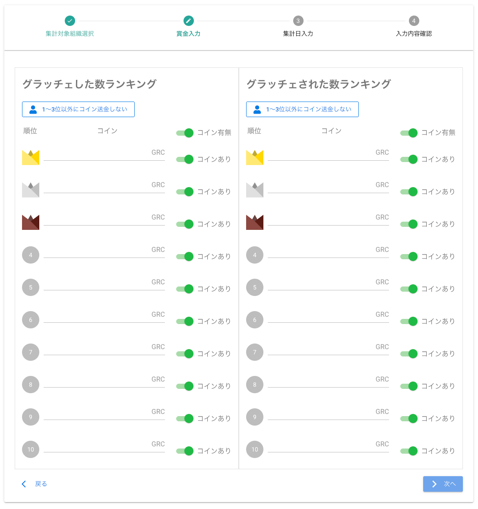

[管理者ユーザマニュアル](/管理者機能/) > [機能説明](/管理者機能/#_16) > [自動集計設定](/管理者機能/#_23) > [賞金入力](#)
# 賞金入力

## 画面

（クリックすると拡大します）

## 画面項目
賞金入力方法は、[表彰画面](../集計・表彰/total03.md)をご参照ください。

- 次へボタン
    - ボタンを押すと[集計日入力画面](./autototal04.md)へ遷移します
- 戻るボタン
    - ボタンを押すと[集計対象組織選択画面](./autototal02.md)へ遷移します

## 使い方

賞金入力方法は、[表彰画面](../集計・表彰/total03.md#_5)をご参照ください。
