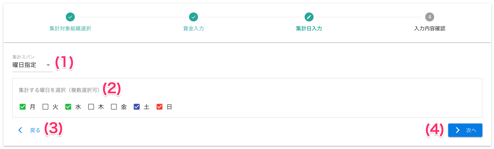
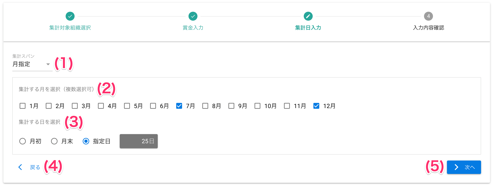
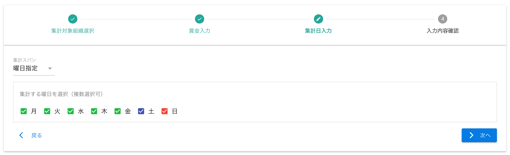
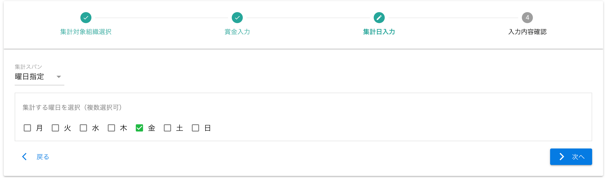
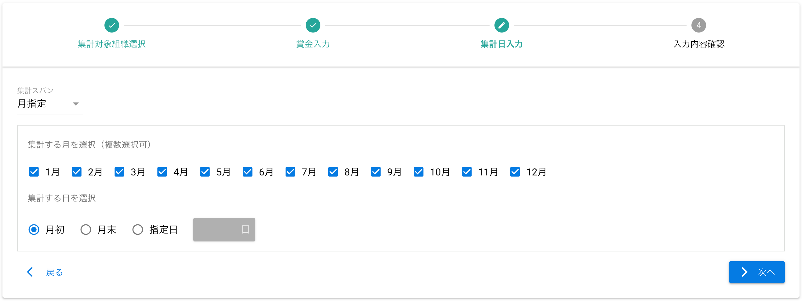
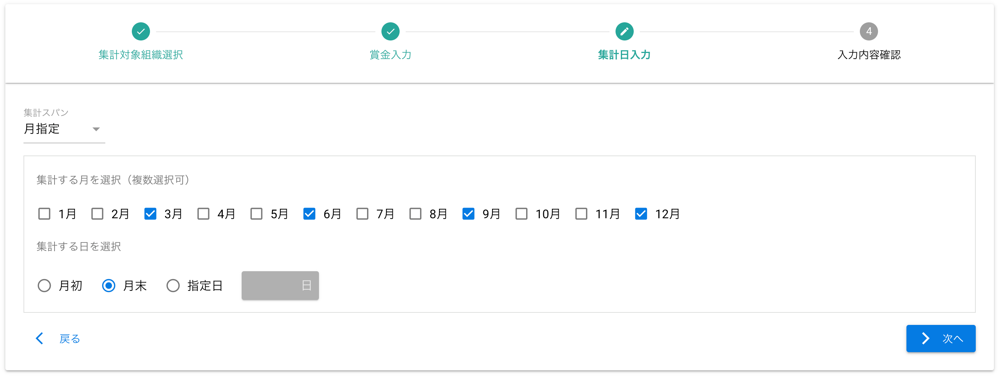

[管理者ユーザマニュアル](../../../管理者機能/) > [機能説明](../../../管理者機能/#_16) > [自動集計設定](../../../管理者機能/#_23) > [集計日入力](#)
# 集計日入力

## 画面
### 曜日指定

## 画面項目

|   #   | 項目名                   | 必須  | 説明                                                           |
| :---: | :----------------------- | :---: | :------------------------------------------------------------- |
|   1   | 集計スパンプルダウン     |   ○   | 曜日ごとに集計するか、月ごとに集計するか選択します             |
|   2   | 集計曜日チェックボックス |   ○   | 集計する曜日を選択します                                       |
|   3   | 戻るボタン               |   -   | ボタンを押すと[集計対象組織選択画面](autototal02.md)または[賞金入力画面](autototal03.md)へ戻ります |
|   4   | [次へボタン](autototal05.md)               |   -   | ボタンを押すと入力内容確認画面へ遷移します                     |

### 月指定

（クリックすると拡大します）

## 画面項目
|   #   | 項目名                 | 必須  | 説明                                                                                                            |
| :---: | :--------------------- | :---: | :-------------------------------------------------------------------------------------------------------------- |
|   1   | 集計スパンプルダウン   |   ○   | 曜日ごとに集計するか、月ごとに集計するか選択します                                                              |
|   2   | 集計月チェックボックス |   ○   | 集計する月を選択します                                                                                          |
|   3   | 集計日選択             |   ○   | 集計日を選択します ・月初: 集計月の1日 ・月末: 集計月の末日 ・上記以外: 自動集計設定で指定した任意の日 |
|   4   | 一覧へ戻るボタン       |   -   | ボタンを押すと[集計対象組織選択画面](autototal02.md)または[賞金入力画面](autototal03.md)へ戻ります                                                  |
|   5   | [次へボタン](autototal05.md)             |   -   | ボタンを押すと入力内容確認画面へ遷移します                                                                      |

## 使い方

### 曜日指定をする
<iframe src="https://scribehow.com/embed/__NsiHGSn8QRmUNPS8Nmb1AA" width="640" height="640" allowfullscreen frameborder="0"></iframe>

### 月指定をする
<iframe src="https://scribehow.com/embed/__15EhAHjvRNinX4a_l5NHXg" width="640" height="640" allowfullscreen frameborder="0"></iframe>

## 集計スパン設定例

!!! tip
    よくある設定例をご紹介します

### 毎日集計したい
- 集計スパン: `曜日指定`
- 集計曜日: `全てチェック`

### 週に1回集計したい
- 集計スパン: `曜日指定`
- 集計曜日: `金` ... 1つだけチェック
    - 毎週金曜日に1週間分を集計します

### 毎月集計したい
- 集計スパン: `月指定`
- 集計月: `全てチェック`
- 集計日: 集計したい日を任意で指定

### 四半期ごとに集計したい
- 集計スパン: `月指定`
- 集計月: `3ヶ月おきにチェック`
- 集計日: `月末`

上記の設定をすると、以下の期間で年4回の集計が行われます

- 1月1日〜3月31日
- 4月1日〜6月30日
- 7月1日〜9月30日
- 10月1日〜12月31日

### 1年に1回集計したい
- 集計スパン: `月指定`
- 集計月: `1つだけチェック`
- 集計日: `月末`

上記の設定をすると、以下の期間で年1回の集計が行われます

- 1月1日〜12月31日