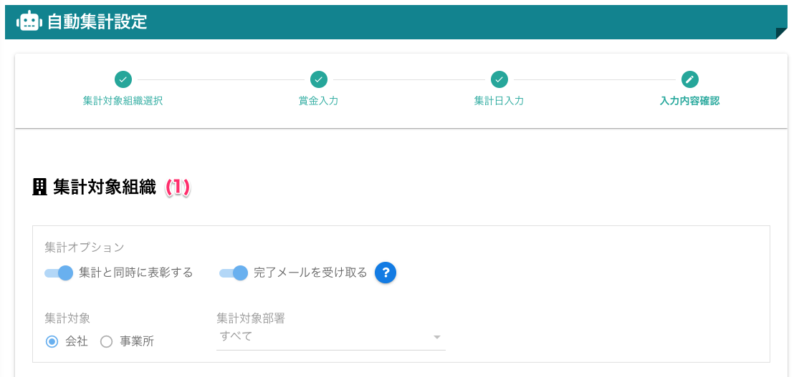
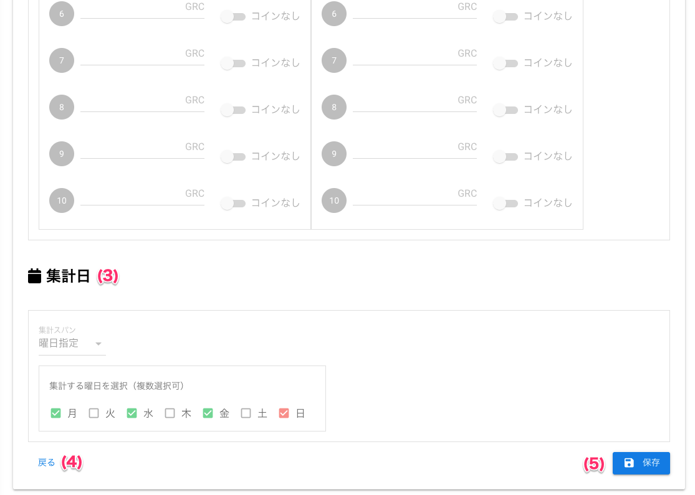

[管理者ユーザマニュアル](/管理者機能/) > [機能説明](/管理者機能/#_16) > [自動集計設定](/管理者機能/#_23) > [入力内容確認](#)
# 入力内容確認

## 画面

（クリックすると拡大します）

## 画面項目
|   #   | 項目名               | 必須  | 説明                                                           |
| :---: | :------------------- | :---: | :------------------------------------------------------------- |
|   1   | 集計対象組織入力内容 |   -   | 集計対象組織画面で入力した内容を表示します                     |
|   2   | 賞金入力内容         |   -   | 集計対象組織画面で入力した内容を表示します                     |
|   3   | 集計日入力内容       |   -   | 集計対象組織画面で入力した内容を表示します                     |
|   4   | [戻るボタン](autototal04.md)           |   -   | ボタンを押すと集計日入力画面へ戻ります |
|   5   | 保存ボタン           |   -   | ボタンを押すと入力内容した内容で自動集計設定を保存します                     |

## 使い方

### 入力内容を確認して保存する
<iframe src="https://scribehow.com/embed/__Cs4a_NmBQHyGW8XU1IMVrQ" width="640" height="640" allowfullscreen frameborder="0"></iframe>

