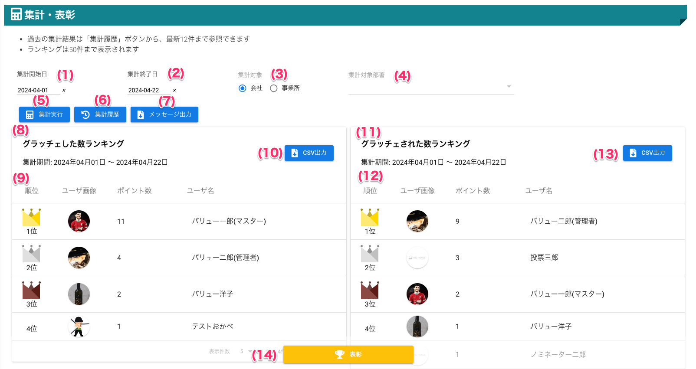

# 集計・表彰

## 画面
<a href="../../../images/total/1-1.png" data-lightbox="スクリーンショット" data-title="スクリーンショット">
    
</a>

（クリックすると拡大します）


## 画面項目
|   #   | 項目名                       | 必須  | 説明                                                                               |
| :---: | :--------------------------- | :---: | :--------------------------------------------------------------------------------- |
|   1   | 集計開始日                   |   ○   | 集計したい期間を選択します。集計終了日よりも未来日を指定できません。               |
|   2   | 集計終了日                   |   ○   | 集計したい期間を選択します。集計開始日よりも過去日を指定できません。               |
|   3   | 集計対象                     |   ○   | 集計対象を選択します                                                               |
|   4   | 集計対象部署                 |   ○   | 集計対象とする部署を選択します                                                     |
|   5   | 集計実行ボタン               |   -   | ボタンを押すと指定された集計条件で集計を実行します                                 |
|   6   | 集計履歴ボタン               |   -   | ボタンを押すと集計を実行した履歴を表示します                                       |
|   7   | メッセージ出力ボタン   |   -   | ボタンを押すと指定された集計条件でEXCELファイルとしてダウンロードします                                |
|   8   | グラッチェした数ランキング   |   -   | 集計期間・順位表・CSV出力ボタンを表示します                                        |
|   9   | 順位表                       |   -   |                                                                                    |
|       | 順位                         |   -   | ポイント数による順位です                                                           |
|       | ユーザ画像                   |       | ユーザが設定している画像です                                                       |
|       | ポイント数                   |   -   | 集計期間内にユーザが獲得したポイント数です                                         |
|       | ユーザ名                     |   -   | ユーザの名前です                                                                   |
|  10   | CSV出力ボタン                |   -   | ボタンを押すとランキングデータをCSVファイルとしてダウンロードします                |
|  11   | グラッチェされた数ランキング |   -   | 集計期間・順位表・CSV出力ボタンを表示します                                        |
|  12   | 順位表                       |       |                                                                                    |
|       | 順位                         |   -   | ポイント数による順位です                                                           |
|       | ユーザ画像                   |   -   | ユーザが設定している画像です                                                       |
|       | ポイント数                   |   -   | 集計期間内にユーザが獲得したポイント数です                                         |
|       | ユーザ名                     |   -   | ユーザの名前です                                                                   |
|  13   | CSV出力ボタン                |   -   | ボタンを押すとランキングデータをCSVファイルとしてダウンロードします                |
|  14   | 表彰ボタン                   |   -   | ボタンを押すと表示しているランキングのユーザにコインを送るための表彰画面を開きます |


## 使い方

### 期間・対象を指定して、グラッチェポイントを集計する
<iframe src="https://scribehow.com/embed/__mCjKNgzJTC6BeuI365z7Hw" width="640" height="640" allowfullscreen frameborder="0"></iframe>


### [過去に集計した結果を確認する](total02.md)


### [集計結果に表示されているユーザを表彰する（コインを送る）](total03.md)

### ランキングデータをCSVファイルとしてダウンロードする
<iframe src="https://scribehow.com/embed/CSV__hu8wZb-7Sze7VD9ZHm8z5Q" width="640" height="640" allowfullscreen frameborder="0"></iframe>

!!! info
    - CSVファイル名
        1. グラッチェしたランキング: `[グラッチェしたランキング]会社名_事業所名_集計開始日-集計終了日.csv`
        2. グラッチェしたランキング:  `[グラッチェされたランキング]会社名_事業所名_集計開始日-集計終了日.csv`

#### CSVファイルの内容

```csv
順位,ポイント数,ユーザ名,メールアドレス,事業所ID,事業所名,部署ID,部署名
1,141,バリュー一郎(マスター),master-001@sute.jp,0000000001,バリューソフトウエア,0000000002,経理・会計課
2,11,vsc11,vsc11@graziecoin.jp,0000000001,バリューソフトウエア,0000000003,総務課
3,10,vsc10,vsc10@graziecoin.jp,0000000001,バリューソフトウエア,0000000003,総務課
4,9,vsc9,vsc9@graziecoin.jp,0000000001,バリューソフトウエア,0000000001,人事課
5,8,vsc8,vsc8@graziecoin.jp,0000000001,バリューソフトウエア,0000000003,総務課
6,7,vsc7,vsc7@graziecoin.jp,0000000001,バリューソフトウエア,0000000002,経理・会計課
7,6,vsc6,vsc6@graziecoin.jp,0000000001,バリューソフトウエア,0000000001,人事課
8,5,vsc4,vsc4@graziecoin.jp,0000000001,バリューソフトウエア,0000000028,開発部
9,4,vsc5,vsc5@graziecoin.jp,0000000001,バリューソフトウエア,0000000003,総務課
10,3,vsc3,vsc3@graziecoin.jp,0000000001,バリューソフトウエア,0000000003,総務課
11,1,バリュー二郎(管理者),admin-001@sute.jp,0000000001,バリューソフトウエア,0000000001,人事課
11,1,vsc13,vsc13@graziecoin.jp,0000000001,バリューソフトウエア,0000000003,総務課
11,1,経理,vsc2@graziecoin.jp,0000000001,バリューソフトウエア,0000000002,経理・会計課
```

### 期間・対象を選択して、グラッチェメッセージをダウンロードする
<iframe src="https://scribehow.com/embed/Generate_Report_for_Dates_and_Messages__rZN0lMdpS1iocLd5ULMkBw" width="640" height="640" allowfullscreen frameborder="0"></iframe>