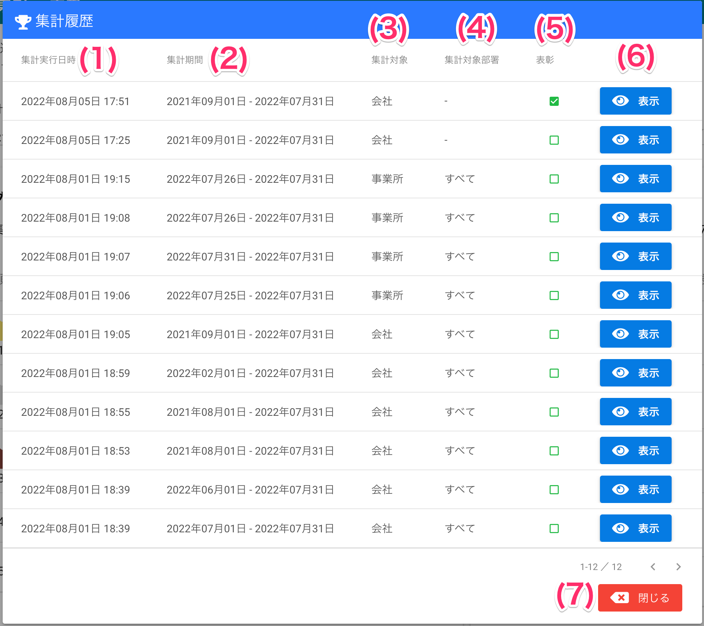

[管理者ユーザマニュアル](/管理者機能/) > [機能説明](/管理者機能/#_16) > [集計・表彰](/管理者機能/#_22) > [集計実行](./total01.md) > [集計履歴](#)
# 集計履歴

## 画面

（クリックすると拡大します）

## 画面項目
|   #   | 項目名       | 必須  | 説明                                                                 |
| :---: | :----------- | :---: | :------------------------------------------------------------------- |
|   1   | 集計実行日時 |   -   | 集計を実行した日時です |
|   2   | 集計期間     |   -   | 集計実行時に指定された集計開始日と集計終了日です |
|   3   | 集計対象     |   -   | 集計実行時に指定された集計対象です                                                 |
|   4   | 集計対象部署 |   -   | 集計実行時に指定された部署です                                       |
|   5   | 表彰         |   -   | 集計履歴を元に表彰が行われたかどうかを表します。 チェックがつけられていると表彰済であることを指します。                   |
|   6   | [表示ボタン](#_6)   |   -   | ボタンを押すと選択された行の集計結果を表示します                        |
|   7   | [閉じるボタン](total01.md) |   -   | 集計期間・順位表・CSV出力ボタンを表示します                          |

## 使い方

### 集計履歴を確認する
<iframe src="https://scribehow.com/embed/__0plC_2AaREirS_mXz7FJwQ" width="640" height="640" allowfullscreen frameborder="0"></iframe>

### 集計履歴から集計結果を表示する
<iframe src="https://scribehow.com/embed/__eZ5OcmBzQZu9H5Y-YwMfFQ" width="640" height="640" allowfullscreen frameborder="0"></iframe>

