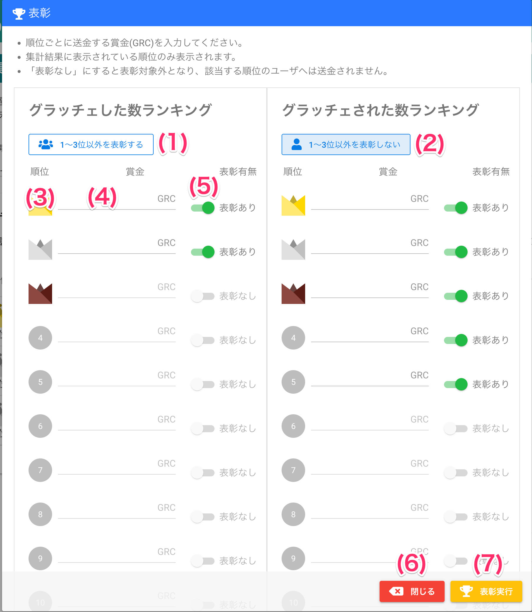

[管理者ユーザマニュアル](/管理者機能/) > [機能説明](/管理者機能/#_16) > [集計・表彰](/管理者機能/#_22) > [集計実行](./total01.md) > [表彰](#)
# 表彰

## 画面

（クリックすると拡大します）

## 画面項目
|   #   | 項目名                       | 必須  | 説明                                                                                                                                        |
| :---: | :--------------------------- | :---: | :------------------------------------------------------------------------------------------------------------------------------------------ |
|   1   | 1〜3位以外を表彰するボタン   |   -   | ボタンを押すと4〜10位までの表彰有無スイッチがONに切り替わります。 ボタンを押した後は、ボタン名が`1〜3位以外を表彰しないボタン`になります |
|   2   | 1〜3位以外を表彰しないボタン |   -   | ボタンを押すと4〜10位までの表彰有無スイッチがOFFに切り替わります。 ボタンを押した後は、ボタン名が`1〜3位以外を表彰するボタン`になります  |
|   3   | 順位                         |   ○   | 順位です                                                                                                                                    |
|   4   | 賞金金額                     |   ○   | 順位に該当するユーザへ配布するコインの数を入力します                                                                                        |
|   5   | 表彰有無スイッチ             |   -   | ONにすると順位に該当するユーザにコインを送ります。OFFの場合は表彰対象外になりコインは送られません。                                         |
|   6   | [閉じるボタン](total01.md)                 |   -   | ボタンを押すと表彰画面を閉じます                                                                                                            |
|   7   | 表彰実行ボタン               |   -   | ボタンを押すと入力された内容で、表彰有無ONの順位に該当するユーザにコインを送ります                                                            |

## 使い方

### 表彰する

<iframe src="https://scribehow.com/embed/__b8o8iGGiSEmbiKwfLbQ4RA" width="640" height="640" allowfullscreen frameborder="0"></iframe>

